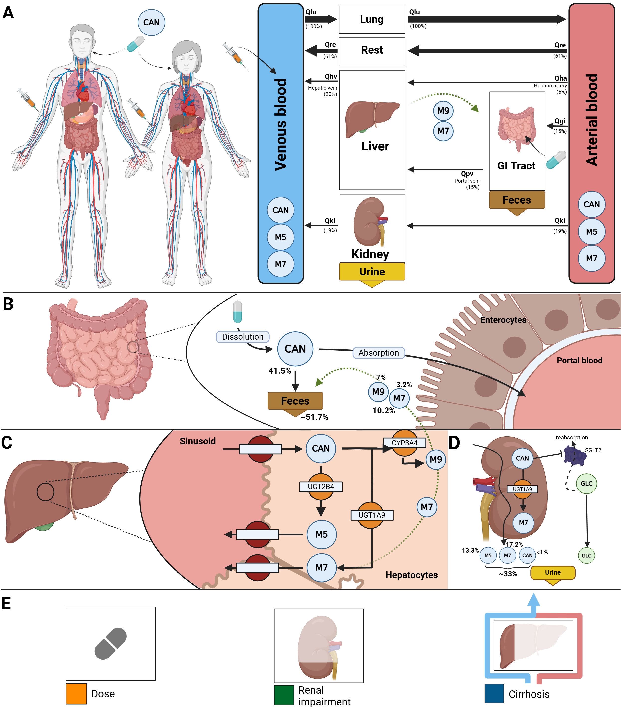

# canagliflozin model
This repository provides the canagliflozin physiologically based pharmacokinetics/ pharmacodynamics (PBPK/PD) model.

The model is distributed as [SBML](http://sbml.org) format available from [`canagliflozin_body_flat.xml`](./models/canagliflozin_body_flat.xml) with 
corresponding [SBML4humans model report](https://sbml4humans.de/model_url?url=https://raw.githubusercontent.com/matthiaskoenig/canagliflozin-model/main/models/canagliflozin_body_flat.xml) and [model equations](./models/canagliflozin_body_flat.md).

The COMBINE archive is available from [`canagliflozin_model.omex`](./canagliflozin_model.omex).

### Comp submodels
* **liver** submodel [`canagliflozin_liver.xml`](./models/canagliflozin_liver.xml) with [SBML4humans report](https://sbml4humans.de/model_url?url=https://raw.githubusercontent.com/matthiaskoenig/canagliflozin-model/main/models/canagliflozin_liver.xml) and [equations](./models/canagliflozin_liver.md).
* **kidney** submodel [`canagliflozin_kidney.xml`](./models/canagliflozin_kidney.xml) with [SBML4humans report](https://sbml4humans.de/model_url?url=https://raw.githubusercontent.com/matthiaskoenig/canagliflozin-model/main/models/canagliflozin_kidney.xml) and [equations](./models/canagliflozin_kidney.md).
* **intestine** submodel [`canagliflozin_intestine.xml`](./models/canagliflozin_intestine.xml) with [SBML4humans report](https://sbml4humans.de/model_url?url=https://raw.githubusercontent.com/matthiaskoenig/canagliflozin-model/main/models/canagliflozin_intestine.xml) and [equations](./models/canagliflozin_intestine.md).
* **whole-body** submodel [`canagliflozin_body.xml`](./models/canagliflozin_body.xml) with [SBML4humans report](https://sbml4humans.de/model_url?url=https://raw.githubusercontent.com/matthiaskoenig/canagliflozin-model/main/models/canagliflozin_body.xml) and [equations](./models/canagliflozin_body.md).

## How to cite

> Tereshchuk, V., Elias, M. & König, M. (2026).
> *Physiologically based pharmacokinetic/pharmacodynamic (PBPK) model of canagliflozin.*   
> Zenodo. [https://doi.org/10.5281/zenodo.13759839](https://doi.org/10.5281/zenodo.13759839)

## License

* Source Code: [MIT](https://opensource.org/license/MIT)
* Documentation: [CC BY-SA 4.0](https://creativecommons.org/licenses/by-sa/4.0/)
* Models: [CC BY-SA 4.0](https://creativecommons.org/licenses/by-sa/4.0/)

This program is distributed in the hope that it will be useful, but WITHOUT ANY
WARRANTY; without even the implied warranty of MERCHANTABILITY or FITNESS FOR A
PARTICULAR PURPOSE.

## Funding
Matthias König was supported by the Federal Ministry of Research, Technology and Space (BMFTR, Germany) within ATLAS by grant number 031L0304B and by the German Research Foundation (DFG) within the Research Unit Program FOR 5151 QuaLiPerF (Quantifying Liver Perfusion-Function Relationship in Complex Resection - A Systems Medicine Approach) by grant number 436883643 and by grant number 465194077 (Priority Programme SPP 2311, Subproject SimLivA). This work was supported by the BMBF-funded de.NBI Cloud within the German Network for Bioinformatics Infrastructure (de.NBI) (031A537B, 031A533A, 031A538A, 031A533B, 031A535A, 031A537C, 031A534A, 031A532B).

© 2023-2026 Vera Tereshchuk, Michelle Elias, and Matthias König, [Systems Medicine of the Liver](https://livermetabolism.com)
